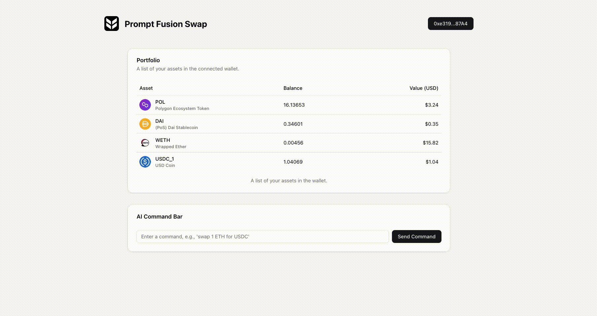

<div align="center">
  
  <h1>Prompt Fusion Swap</h1>
  <p>An AI-powered DeFi terminal to execute swaps via natural language, using multiple 1inch APIs.</p>
</div>

---

### Demo



## Core Features

**Prompt Fusion Swap** merges a real-time, analytical portfolio dashboard with an AI-powered, natural language command interface.

* **Real-Time Portfolio Dashboard**: Connect your wallet to get an instant, comprehensive overview of your assets. The dashboard displays balances, current USD prices, and total values for all your holdings.
* **AI Command Interface**: Execute complex trades as easily as talking to an assistant. Simply type commands like *"Swap 0.1 WETH for USDC"* or *"Sell half of my POL for Dai"* and let the AI handle the rest.

## Tech Stack & 1inch API Usage

This project is a full-stack dApp built with **Next.js**, **wagmi**, **Viem**, and **TypeScript**. It leverages the **Gemini API** for natural language processing and is deeply integrated with the 1inch Network.

To meet the "Build a full Application using 1inch APIs" prize requirements, we made heavy use of the following APIs:

* **Balance API**: Used in `getWalletBalances` to fetch all token balances for the connected wallet.
* **Spot Price API**: Used in `getTokensPrices` to get accurate, real-time USD prices for all user assets.
* **Token API**: Used in `getTokensInfo` to fetch rich token metadata like names, symbols, and logos to provide a better user experience.
* **Swap API**: The core of our trading functionality. We use it to:
    * `getSwapQuote`: Find the best possible swap rates.
    * `checkAllowance` & `getApproveTransaction`: Handle token approvals seamlessly.
    * `getSwapTransactionData`: Construct the final transaction for the user to sign.

## Getting Started

First, set up your environment variables. Create a file named `.env.local` in the root of the project and add your API keys:

```bash
GEMINI_API_KEY="YOUR_GEMINI_API_KEY"
ONEINCH_API_KEY="YOUR_1INCH_API_KEY"
